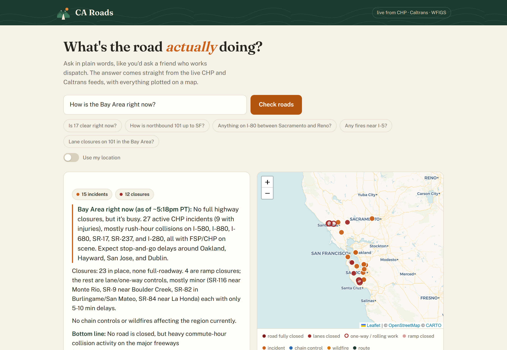
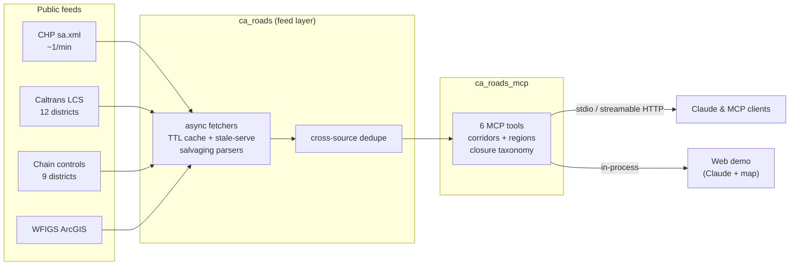

<div align="center">
  
  <h1>CA Roads</h1>
  <p><b>Live California road conditions for AI assistants, over MCP.</b></p>

[](https://github.com/nicglazkov/ca-roads-mcp/actions/workflows/ci.yml)
[](EVALS.md)
[](LICENSE)
[](pyproject.toml)

  <p>
    <a href="#add-to-claude">Add to Claude</a> ·
    <a href="https://ca-roads-demo-15002631928.us-west1.run.app">Web demo</a> ·
    <a href="#tools">Tools</a> ·
    <a href="#evals">Evals</a> ·
    <a href="#how-it-works">How it works</a>
  </p>
</div>

Ask "do I need chains to get to Tahoe?" or "is 17 clear right now?" and the
answer comes from the live feeds CHP and Caltrans publish. The model reads
the actual dispatch logs instead of guessing from memory. One connector URL.
No account and no key.

No AI assistant? The [web demo](https://ca-roads-demo-15002631928.us-west1.run.app)
answers the same questions in a browser and plots everything on a map.

<div align="center">
  
</div>

## Add to Claude

Hosted (recommended): add a custom connector with this URL:

```
https://ca-roads-mcp-15002631928.us-west1.run.app/mcp
```

Local over stdio:

```json
{
  "mcpServers": {
    "ca-roads": {
      "command": "uvx",
      "args": ["--from", "git+https://github.com/nicglazkov/ca-roads-mcp", "ca-roads-mcp"]
    }
  }
}
```

Or from a checkout: `pip install .` then `ca-roads-mcp` (stdio) or
`ca-roads-mcp --transport http` (streamable HTTP on `$PORT`).

## What it knows

| Source | Data | Refresh |
|--------|------|---------|
| **CHP live feed** | Statewide incidents (collisions, hazards, closures) as dispatchers log them, with travel direction parsed from the location text | Fetched per request; feed updates ~1/min |
| **Caltrans LCS** | Lane and road closures physically in place right now (CHP code 1097), classified by what they mean for through traffic | 5-minute cache |
| **Caltrans chain controls** | R-1/R-2/R-3 requirements at mountain checkpoints | 5-minute cache |
| **WFIGS** | Active wildfires (name, size, containment), flagged within ~10 miles of major highways | 5-minute cache |

Every closure record carries a `closure_class` derived from the Caltrans
facility and closure type. The raw feed marks an on-ramp repair "Full", and
reporting that as a closed highway would be wrong, so the classes keep them
apart:

| closure_class | Means | Can you drive through? |
|---|---|---|
| `full-roadway` | The road itself is closed in that direction | No |
| `one-way-traffic` | Alternating single lane with flagging | Yes, with delays |
| `alternating-lanes` / `moving` / `traffic-break` | Rolling or brief work | Yes, minor delays |
| `lane` | Some lanes closed ("2 of 4 lanes closed") | Yes |
| `ramp` | One ramp or connector closed, road unaffected | Yes |

Every response carries per-source `data_as_of` timestamps and explicit notes
when a feed is stale or failing, so the assistant can say how much to trust
the answer. Feed failures are never silent: the last good data is served,
flagged stale, with the error attached.

## Tools

| Tool | What it answers |
|------|-----------------|
| `check_route(from_place, to_place)` | Everything active along a major corridor (17 curated corridors: I-80 Sacramento-Reno, US-50 to Tahoe, I-5, US-101, SR-17, SR-99, SR-1, I-15 to Vegas, Bay Area freeways, Tahoe locals), ordered by miles along the route |
| `check_region(region)` | One-call report for a whole region (Bay Area, SoCal, Sierra, Central Valley, and four more): exact counts, incidents severity-sorted, full closures first, capped lists that say when they truncate |
| `get_incidents(highway?, area?, center?)` | Live CHP incidents by route, dispatch area, or a point and radius |
| `get_lane_closures(route?, district?, center?)` | Closures in place right now, classified per the table above |
| `get_chain_controls(route?, center?)` | Current chain requirements; says "none active" explicitly in the off-season |
| `get_wildfires(near_route?, center?)` | Active fires with size and containment, flagged near major highways |

A `road_trip_check` prompt template shows clients how to compose the tools
for a trip check. Place names work everywhere: the assistant resolves a town
to coordinates, and a `center` radius sweeps every road around it, including
the small ones.

## Evals

The eval suite ships with the server and gates every release:

- **Recorded fixtures** for three scenarios: a Sierra storm day (R-2 chains
  Twin Bridges to Meyers, avalanche closure at Emerald Bay), a fire-closure
  day (I-5 shut both directions at the Grapevine), and a quiet summer day.
  A recording mode banks real feed captures for future scenarios.
- **85 golden questions** with ground truth, including traps: closures that
  are scheduled but not established, ramp closures phrased as "is the
  highway closed", forecast questions the data cannot answer.
- **A grading harness** that runs Claude against the tools in fixture mode
  and scores exact-fact matching plus an LLM judge, with a failure taxonomy
  (missed condition, hallucinated event, stale-data trust, wrong location).

Current scorecard: [EVALS.md](EVALS.md). Evals re-run on every release via
GitHub Actions and update the badge above.

```sh
pip install -e ".[dev,evals]"
python evals/build_fixtures.py       # regenerate scenario fixtures
python evals/run_evals.py            # needs ANTHROPIC_API_KEY
```

## How it works



Three packages, cleanly layered:

- **`ca_roads`**: the feed layer. No MCP dependency. Async httpx fetchers,
  per-district TTL caches, stale-serve on upstream failure, parsers that
  salvage complete records from truncated feeds (CHP cuts its XML mid-record
  on busy days), and rules learned from running these feeds in production,
  like treating a missing district feed as an empty result instead of an
  error.
- **`ca_roads_mcp`**: the MCP surface. FastMCP server, curated corridor and
  region tables, route-name normalization ("17", "hwy 50", "I80" all work),
  and docstrings written for the LLM consumer: what the data is, its refresh
  cadence, and its limits.
- **`ca_roads_demo`**: the public demo. Claude in a tool loop over the same
  tool functions, streaming SSE with map geometry, hard cost caps (per-IP
  rate limit, daily question caps, a global daily dollar budget).

## Development

```sh
python -m venv .venv && . .venv/bin/activate   # or .venv\Scripts\activate
pip install -e ".[dev]"
pytest        # fixture-based, no network
ruff check .
```

Use the stdio transport for local work. The http transport is tuned for
Cloud Run: it binds 0.0.0.0 with host-header checks off, so if you must run
it locally, bind it to localhost (`ca-roads-mcp --transport http --host
127.0.0.1`).

Docs: [deploying](docs/deploy.md) ·
[adding a data source](docs/adding-a-source.md) ·
[registry submission](docs/registry.md)

## Disclaimer

Data: CHP, Caltrans, WFIGS. Not affiliated with any agency. Conditions
change faster than any feed; verify before you drive (511 or
[quickmap.dot.ca.gov](https://quickmap.dot.ca.gov)).

The server resolves place names through the Nominatim and Photon
OpenStreetMap geocoders. The web demo additionally loads map tiles from
CARTO and fetches its route preview from the public OSRM and Valhalla
routers, so those services see the coordinates involved. Fonts and map
libraries are served locally.
