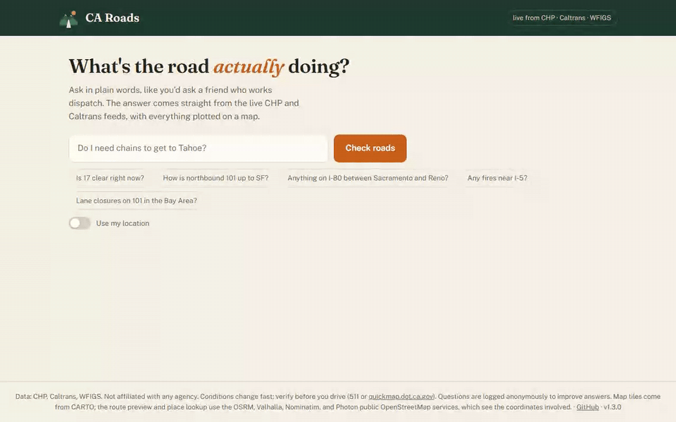
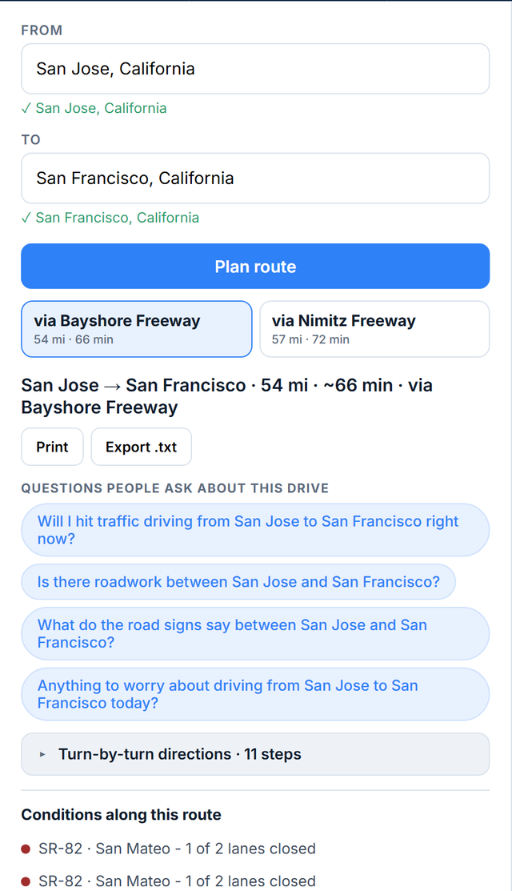
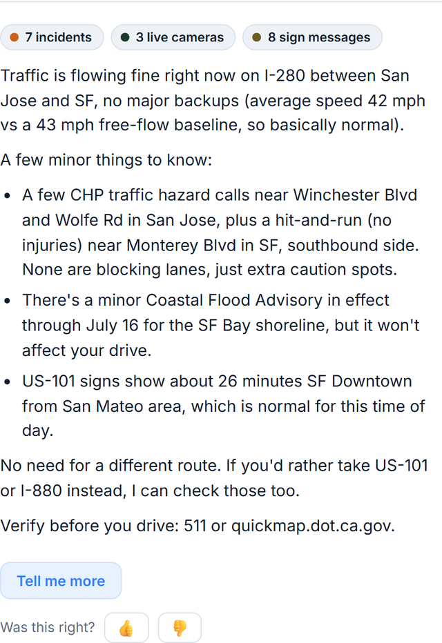
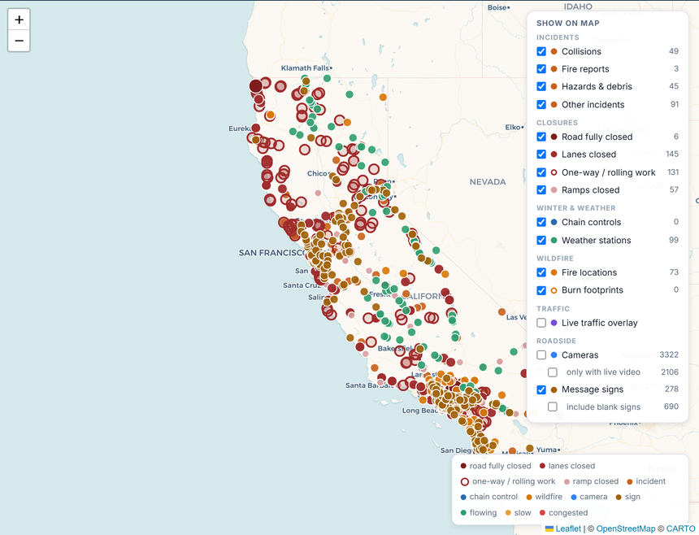
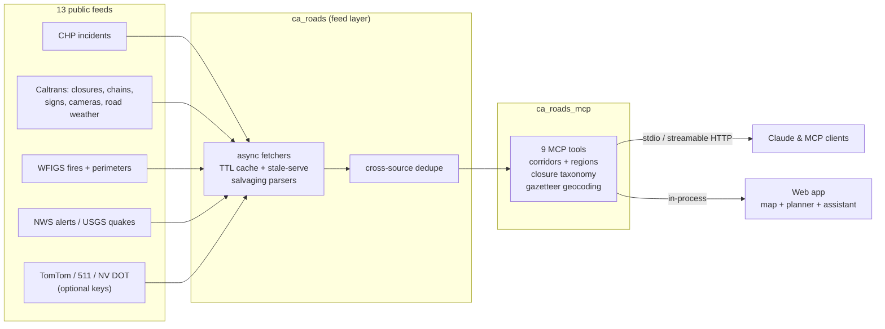

<div align="center">
  
  <h1>CA Roads</h1>
  <p><b>A live map, route planner, and AI assistant for California roads.<br>
  Also an MCP server, so your assistant can use it too.</b></p>

[](https://github.com/nicglazkov/ca-roads-mcp/actions/workflows/ci.yml)
[](https://github.com/nicglazkov/ca-roads-mcp/releases)
[](EVALS.md)
[](LICENSE)
[](pyproject.toml)

  <p>
    <a href="#the-hosted-app">Hosted app</a> ·
    <a href="#add-to-claude">Add to Claude</a> ·
    <a href="#self-hosting">Self-hosting</a> ·
    <a href="#what-it-knows">Data</a> ·
    <a href="#tools">Tools</a> ·
    <a href="#evals">Evals</a>
  </p>

  <p>
    <a href="https://ca-roads-demo-15002631928.us-west1.run.app">
      
    </a>
  </p>
  <p>
    No install, no account:
    <a href="https://ca-roads-demo-15002631928.us-west1.run.app"><b>ca-roads-demo-15002631928.us-west1.run.app</b></a>
  </p>

  <a href="https://ca-roads-demo-15002631928.us-west1.run.app">
    
  </a>
</div>

This started as an MCP server that gives AI assistants live California
road data. It grew a web app around it. The map shows what the CHP and
Caltrans feeds are reporting right now, you can plan a route and print
the directions, and there is an assistant if you want to ask about a
drive in plain English.

I host a copy anyone can use. If you would rather run your own, see
[self-hosting](#self-hosting).

## The hosted app

**[ca-roads-demo-15002631928.us-west1.run.app](https://ca-roads-demo-15002631928.us-west1.run.app)**

What is on it:

- The map, with a filter panel for each layer: incidents by type,
  closures by class, chain controls, weather stations, fires and their
  burn footprints, about 3,300 cameras (there is a checkbox for only the
  ones with live video), and the message signs currently displaying
  something. Click a camera for a snapshot that was verified live moments
  earlier. Sign popups quote the sign word for word.
- A route planner. Addresses autocomplete as you type, the From field
  has a use-my-location option, and ambiguous names ask which one you
  meant. You get turn-by-turn directions (tucked behind a dropdown),
  whatever is happening along the way, and print or .txt export.
- The assistant. After you plan a route, a few ready-made questions
  about that drive show up. Tap one and the answer streams in, built
  from the same live feeds, with times in your time zone.

<table>
  <tr>
    <td width="34%"><br><sub><b>Plan a trip.</b> Autocomplete, route options, directions, print or export.</sub></td>
    <td width="34%"><br><sub><b>Ask about it.</b> One tap on a suggested question; the answer reads the live feeds.</sub></td>
    <td width="32%"><br><sub><b>Or just look.</b> Every layer toggleable, from full closures to blank signs.</sub></td>
  </tr>
</table>

Fair warning on the hosting: this runs on a small personal budget. The
AI answers have daily caps, the service scales to zero so the first
load of the day can take a few seconds, and there is no uptime promise.
It is a portfolio project, not a utility.

## Add to Claude

This uses my hosted server, so the same caveats apply. Add a custom
connector with this URL:

```
https://ca-roads-mcp-15002631928.us-west1.run.app/mcp
```

## Self-hosting

Everything here is MIT licensed and runs without any accounts or keys.
The optional traffic-speed and Bay Area feeds need free keys.

Run the MCP server locally over stdio (this is the config for Claude
Desktop or Claude Code):

```json
{
  "mcpServers": {
    "ca-roads": {
      "command": "uvx",
      "args": ["--from", "git+https://github.com/nicglazkov/ca-roads-mcp", "ca-roads-mcp"]
    }
  }
}
```

From a checkout: `pip install .` then `ca-roads-mcp` for stdio, or
`ca-roads-mcp --transport http` for streamable HTTP on `$PORT`. The web
app is `pip install ".[demo]"` then `ca-roads-demo` with an
`ANTHROPIC_API_KEY` in the environment.

To put your own copy on Cloud Run (small enough to fit the free tier
most months), [docs/deploy.md](docs/deploy.md) has the exact commands,
the environment variables, and where the optional API keys go.

## What it knows

| Source | Data | Refresh |
|--------|------|---------|
| **CHP live feed** | Statewide incidents (collisions, hazards, closures) as dispatchers log them, with travel direction parsed from the location text | Fetched per request; feed updates ~1/min |
| **Caltrans LCS** | Lane and road closures physically in place right now (CHP code 1097), classified by what they mean for through traffic | 5-minute cache |
| **Caltrans chain controls** | R-1/R-2/R-3 requirements at mountain checkpoints | 5-minute cache |
| **WFIGS** | Active wildfires (name, size, containment), flagged within ~10 miles of major highways; perimeter edges refine distances for big fires | 5-minute cache |
| **Caltrans CMS** | What changeable message signs display right now (blank signs filtered) | 2-minute cache |
| **Caltrans CCTV** | Roadside camera snapshots, image-verified live before return | per query |
| **Caltrans RWIS** | Road-weather stations: pavement temperature, gusts, visibility on the passes | 5-minute cache |
| **NWS alerts** | Winter storm, wind, flood, fog, and fire-weather warnings along the route | 5-minute cache |
| **USGS quakes** | M4.5+ earthquakes near a corridor in the last 24 hours | 5-minute cache |
| **TomTom** (optional key) | Actual current speeds vs free-flow along the route | 1-minute cache |
| **511 SF Bay** (optional key) | Bay Area traffic events | 3-minute cache |
| **Nevada DOT** (optional key) | I-80, US-50, I-15 continuations past the state line | 3-minute cache |

Every closure record carries a `closure_class` derived from the Caltrans
facility and closure type. The raw feed marks an on-ramp repair "Full", and
reporting that as a closed highway would be wrong, so the classes keep them
apart:

| closure_class | Means | Can you drive through? |
|---|---|---|
| `full-roadway` | The road itself is closed in that direction | No |
| `one-way-traffic` | Alternating single lane with flagging | Yes, with delays |
| `alternating-lanes` / `moving` / `traffic-break` | Rolling or brief work | Yes, minor delays |
| `lane` | Some lanes closed ("2 of 4 lanes closed") | Yes |
| `ramp` | One ramp or connector closed, road unaffected | Yes |

Every response carries per-source `data_as_of` timestamps and explicit notes
when a feed is stale or failing, so the assistant can say how much to trust
the answer. Feed failures are never silent: the last good data is served,
flagged stale, with the error attached.

## Tools

| Tool | What it answers |
|------|-----------------|
| `check_route(from_place, to_place)` | Everything active along a major corridor (17 curated corridors: I-80 Sacramento-Reno, US-50 to Tahoe, I-5, US-101, SR-17, SR-99, SR-1, I-15 to Vegas, Bay Area freeways, Tahoe locals), ordered by miles along the route |
| `check_region(region)` | One-call report for a whole region (Bay Area, SoCal, Sierra, Central Valley, and four more): exact counts, incidents severity-sorted, full closures first, capped lists that say when they truncate |
| `get_incidents(highway?, area?, center?)` | Live CHP incidents by route, dispatch area, or a point and radius |
| `get_lane_closures(route?, district?, center?)` | Closures in place right now, classified per the table above |
| `get_chain_controls(route?, center?)` | Current chain requirements; says "none active" explicitly in the off-season |
| `get_wildfires(near_route?, center?)` | Active fires with size, containment, and mapped perimeter edges, flagged near major highways |
| `get_cameras(center?, route?)` | Roadside camera snapshots, each verified live before it is returned (offline placeholder frames are filtered by image freshness) |
| `get_road_signs(route?, center?)` | What changeable message signs are displaying right now, verbatim |
| `rank_routes(by?, limit?)` | All 17 corridors ranked by live events or measured congestion, with reasons - answers "what are the busiest routes right now" |

Route and region reports also carry context that changes the advice:
weather alerts sampled along the trip, road-weather stations reporting
something notable, recent significant earthquakes, the signs and cameras
along the way, and live speeds when a TomTom key is set. Place names go
through a real geocoder, and when a street exists in several towns the
tool says so and asks instead of guessing.

## Evals

The eval suite ships with the server and gates every release:

- **Recorded fixtures** for four scenarios: a Sierra storm day (R-2 chains
  Twin Bridges to Meyers, avalanche closure at Emerald Bay), a fire-closure
  day (I-5 shut both directions at the Grapevine), a quiet summer day, and
  a real capture of all feeds from an actual fire-season day, replayed
  byte-for-byte including one district feed's 500 error.
- **91 golden questions** with ground truth, including traps: closures that
  are scheduled but not established, ramp closures phrased as "is the
  highway closed", forecast questions the data cannot answer.
- **A grading harness** that runs Claude against the tools in fixture mode
  and scores exact-fact matching plus an LLM judge (claude-opus-4-8, never
  an evaluated model), with a failure taxonomy and a tool-selection drift
  metric. Every run appends to a committed history file so the trend is
  public.

Current scorecard: [EVALS.md](EVALS.md). Evals re-run on every release,
scored against the release tag, and update the badge above.

```sh
pip install -e ".[dev,evals]"
python evals/build_fixtures.py       # regenerate scenario fixtures
python evals/run_evals.py            # needs ANTHROPIC_API_KEY
```

## How it works



Three packages, cleanly layered:

- **`ca_roads`**: the feed layer. No MCP dependency. Async httpx fetchers,
  per-district TTL caches, stale-serve on upstream failure, parsers that
  salvage complete records from truncated feeds (CHP cuts its XML mid-record
  on busy days), and rules learned from running these feeds in production,
  like treating a missing district feed as an empty result instead of an
  error.
- **`ca_roads_mcp`**: the MCP surface. FastMCP server, curated corridor and
  region tables, route-name normalization ("17", "hwy 50", "I80" all work),
  and docstrings written for the LLM consumer: what the data is, its refresh
  cadence, and its limits.
- **`ca_roads_demo`**: the public web app. The standalone map and route
  planner (viewport-driven data API, address autocomplete, turn-by-turn
  via OSRM with a Valhalla fallback), plus Claude in a tool loop over the
  same tool functions, streaming SSE with map geometry, hard cost caps
  (per-IP rate limit, daily question caps, a global daily dollar budget).

## Development

```sh
python -m venv .venv && . .venv/bin/activate   # or .venv\Scripts\activate
pip install -e ".[dev]"
pytest        # fixture-based, no network
ruff check .
```

Use the stdio transport for local work. The http transport is tuned for
Cloud Run: it binds 0.0.0.0 with host-header checks off, so if you must run
it locally, bind it to localhost (`ca-roads-mcp --transport http --host
127.0.0.1`).

Docs: [deploying](docs/deploy.md) ·
[adding a data source](docs/adding-a-source.md) ·
[registry submission](docs/registry.md)

## Disclaimer

Data: CHP, Caltrans, WFIGS. Not affiliated with any agency. Conditions
change faster than any feed; verify before you drive (511 or
[quickmap.dot.ca.gov](https://quickmap.dot.ca.gov)).

The server resolves place names through the Nominatim and Photon
OpenStreetMap geocoders. The web demo additionally loads map tiles from
CARTO and fetches its route preview from the public OSRM and Valhalla
routers, so those services see the coordinates involved. Fonts and map
libraries are served locally.
