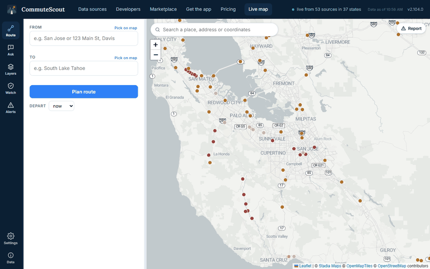
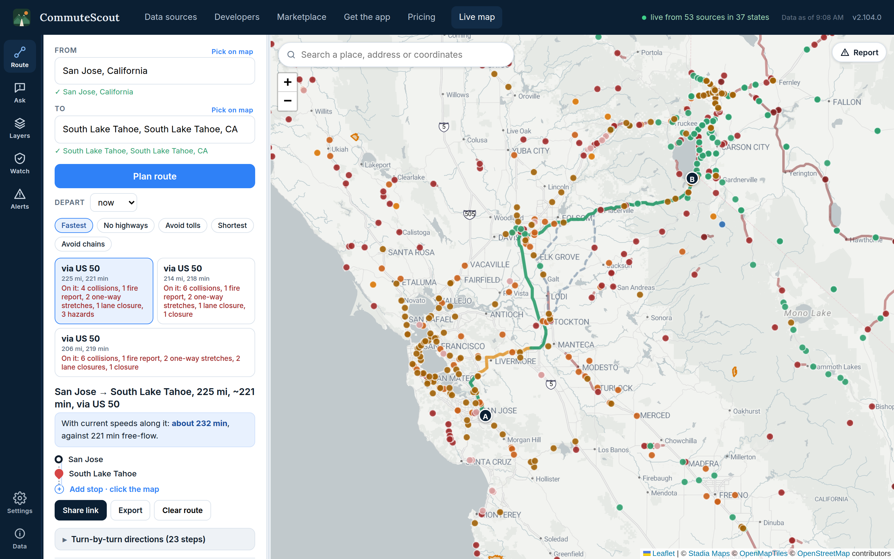
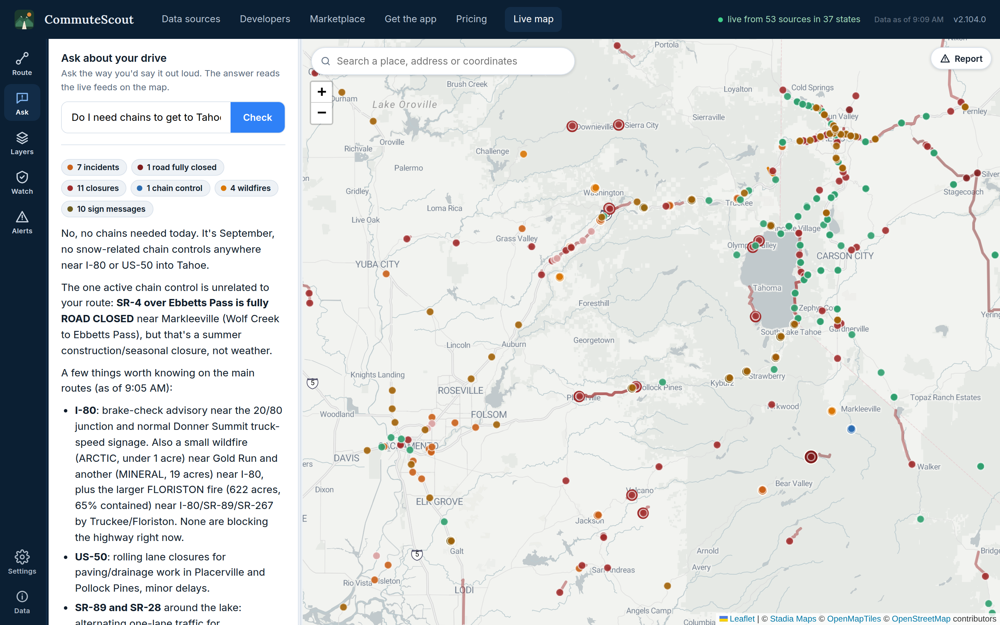
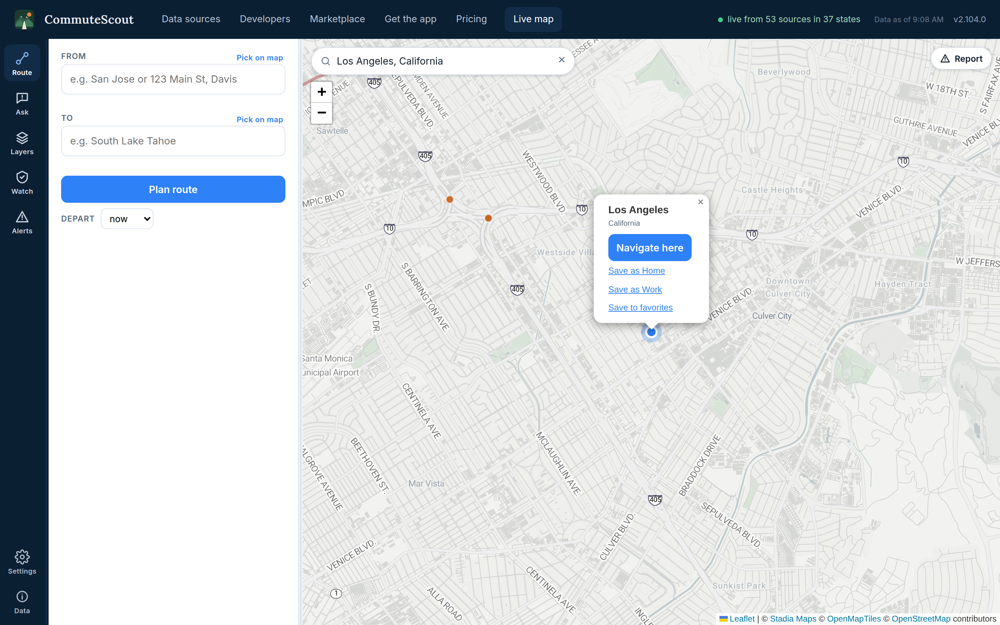
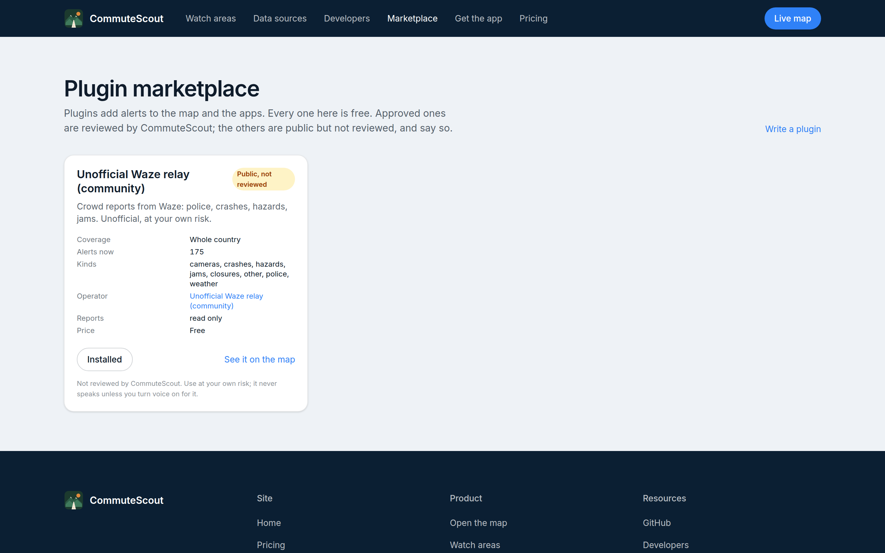
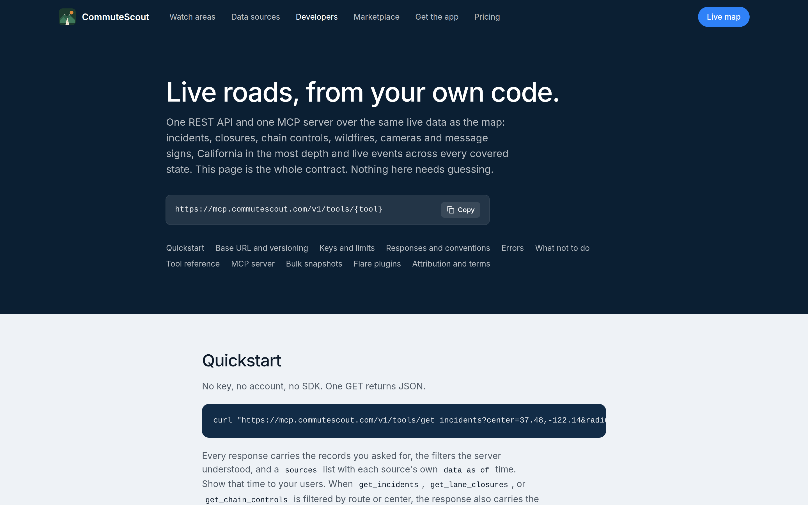

<div align="center">
  
  <h1>CommuteScout</h1>
  <p><b>Live road conditions across 37 states: a map, a route planner, and an
  AI assistant.<br>Also an MCP server, so your assistant can use it too.</b></p>

[](https://github.com/nicglazkov/commutescout/actions/workflows/ci.yml)
[](https://github.com/nicglazkov/commutescout/releases)
[](EVALS.md)
[](LICENSE)

  <p>
    <a href="https://commutescout.com"><b>Open the app</b></a> ·
    <a href="#add-to-claude">Add to Claude</a> ·
    <a href="#coverage">Coverage</a> ·
    <a href="#running-it-yourself">Running it yourself</a> ·
    <a href="docs/data-sources.md">Data</a> ·
    <a href="docs/mcp.md">MCP tools</a> ·
    <a href="docs/architecture.md">Architecture</a>
  </p>

  <p>
    <a href="https://commutescout.com">
      
    </a>
  </p>
  <p>
    No install, no account:
    <a href="https://commutescout.com"><b>commutescout.com</b></a>
  </p>

  <a href="https://commutescout.com">
    
  </a>
</div>

CommuteScout reads 53 official agency feeds (CHP dispatch, state DOT
closures and incidents, chain controls, cameras, message signs, wildfire
perimeters, road weather, toll prices) and turns them into one live
picture of the road. Look at the map, plan a route and see what is
actually on it, or ask about a drive in plain English. The same data is
served over [MCP](docs/mcp.md), so Claude and other AI assistants can use
it as a tool instead of guessing about traffic.

## What you get

- **A live national map:** incidents by type, closures by class, chain
  controls, wildfires with real burn footprints, roadside weather
  stations, roughly 18,000 traffic cameras, and every message sign
  currently displaying something.
- **Toll and express-lane pricing:** current rates on tolled corridors
  and bridges, drawn along the actual carriageway with hand-verified
  gantry positions, so a price tag never floats over the wrong road.
- **A route planner that knows the roads:** autocomplete, route options,
  turn-by-turn directions, live conditions along the way, and print,
  GPX, KML, or share-link export.
- **An assistant that reads the feeds:** plan a route, tap a suggested
  question, and the answer streams in from the same live data with
  per-source timestamps.
- **Plain-English incident detail:** CHP dispatch logs are translated
  from radio shorthand into readable timelines, with each unit's arrival
  and clearance in order.
- **Watch areas:** draw a circle, polygon, or route corridor and get a
  push or email alert when an incident, closure, chain control, or
  wildfire appears inside it.
- **An MCP server:** ten tools over curated corridors and regions, with
  a [closure taxonomy](docs/data-sources.md#the-closure-taxonomy) that
  keeps a closed on-ramp from reading as a closed highway.
- **Turn-by-turn navigation on your phone:** native iOS and Android
  apps that speak what is ahead on the route, not just the next turn.
  Closures, crashes, chain controls and fires are announced by distance
  and filtered to your direction of travel, so a northbound ramp closure
  stays quiet when you are heading south. See
  [commutescout-app](https://github.com/nicglazkov/commutescout-app).
- **Plugins, and a protocol for them:** [Flare](docs/flare.md) is an
  open spec any source can implement to put its own alerts on the map.
  Plugins appear in a marketplace, are labelled by how far they have
  been vetted, and an unreviewed one can never close a road for a
  driver. A reference plugin and its conformance tests live in this repo.
- **A public API:** the same ten tools over plain HTTP, with an OpenAPI
  document, one error envelope, and keys with published rate limits.
  Nothing to sign up for to try it.
- **Public evals:** 91 golden questions on recorded fixtures, scored by
  an LLM judge that is never one of the evaluated models. The
  [scorecard](EVALS.md) is a dated snapshot that names the version it
  reflects, not a release gate; it and its full history are committed
  to this repo.

<table>
  <tr>
    <td width="34%"><br><sub><b>Plan a trip.</b> Autocomplete, route options, directions, print or export.</sub></td>
    <td width="34%"><br><sub><b>Ask about it.</b> One tap on a suggested question; the answer reads the live feeds.</sub></td>
    <td width="32%"><br><sub><b>Or just look.</b> Every layer toggleable, from full closures to blank signs.</sub></td>
  </tr>
  <tr>
    <td width="34%"><br><sub><b>Add a plugin.</b> Each card says what it covers, what it reports, and whether anyone has reviewed it.</sub></td>
    <td width="34%"><br><sub><b>Or build on it.</b> Ten tools over plain HTTP, one error envelope, published rate limits.</sub></td>
    <td width="32%"></td>
  </tr>
</table>

## Coverage

The map covers **37 states**. Coverage is not uniform, because it is
built from what each agency actually publishes: some states offer every
layer keylessly, some publish roadwork only, and a few offer nothing
usable. The map says so directly, shading unsupported states and naming
what is missing rather than showing an empty region.

**California is the deepest.** It is the only state with CHP dispatch
logs, per-lane closure detail, chain-control levels, and CAL FIRE
perimeters. The assistant and the MCP tools answer for every covered
state, but a California question gets that richer detail, while
elsewhere they answer from the normalized state DOT feeds.

Per-state matrix of what is live and why the gaps exist:
**[docs/state-coverage.md](docs/state-coverage.md)**. States not yet
integrated, with the reason for each:
**[docs/state-expansion-audit.md](docs/state-expansion-audit.md)**.

## Get started

Open **[commutescout.com](https://commutescout.com)**. Nothing to run,
nothing to sign up for, feeds already warm. The phone apps are in
[commutescout-app](https://github.com/nicglazkov/commutescout-app).

Watch areas and the assistant are free on the hosted app; watch-area
accounts need approval for now, because each one polls on your behalf.

### Add to Claude

Give Claude live road data with a custom connector:

```
https://mcp.commutescout.com/mcp
```

See it on the site: [commutescout.com/mcp](https://commutescout.com/mcp).
Local stdio setup and the full tool reference: [docs/mcp.md](docs/mcp.md).

### Running it yourself

The code is MIT licensed and the repository is complete, so nothing
stops you running a copy. It is worth being straight about what that
takes: a Cloud Run deployment, credentials for a dozen state feeds, a
Firestore database, map snapshot publishing, a scheduler for watch
areas, and a paid map provider. Keeping that current is most of the work
of the project, and it is not a path I recommend or support.

The MCP server alone is the reasonable exception, since it needs no
accounts or keys:

```json
{
  "mcpServers": {
    "commutescout": {
      "command": "uvx",
      "args": ["--from", "git+https://github.com/nicglazkov/commutescout", "ca-roads-mcp"]
    }
  }
}
```

Read the code, lift what is useful, open an issue if something here is
wrong. [docs/deploy.md](docs/deploy.md) documents the deployment for the
sake of the record rather than as a recipe to follow.

## The data

CHP incidents and dispatch logs; Caltrans and 30-plus other state DOT
closures, incidents, cameras, message signs, and road weather; chain
controls from California and the Pacific Northwest; WFIGS and CAL FIRE
wildfires with perimeters; NWS alerts; USGS quakes; toll and express
lane pricing; and optional TomTom and 511 SF Bay feeds.

Every response carries per-source `data_as_of` timestamps, and a failing
feed is never silent: the last good data is served, flagged stale, with
the error attached and surfaced all the way to the UI.

Full source table, refresh rates, and the closure taxonomy:
**[docs/data-sources.md](docs/data-sources.md)**.

## How good are the answers?

An eval suite scores the assistant against recorded fixtures: four
scenarios (a Sierra storm day, a fire-closure day, a quiet day, and a
byte-for-byte capture of a real fire-season day), 91 golden questions
with ground truth including traps, and an LLM judge that is never an
evaluated model.

Runs are triggered manually rather than on every release. Firing a full
suite on each release turned out to cost more per month than the hosted
assistant serves, so it now runs when a prompt or tool change actually
warrants re-scoring. Every run appends to a committed history file, so
the trend stays public: **[EVALS.md](EVALS.md)**.

## Under the hood

Three cleanly layered Python packages sharing one data spine: a feed
layer with stale-while-revalidate caches and parsers that salvage
complete records from truncated feeds, the MCP surface, and the web app.

The map does not boot through the API. A publisher builds the whole
coverage area once per cycle and uploads pre-gzipped snapshots to object
storage behind a CDN, so first paint is an edge-cached static file and no
visitor request waits on a server assembling JSON. A map left open on a
wall monitor keeps updating in place indefinitely.

Diagram and design notes: **[docs/architecture.md](docs/architecture.md)**.

## Contributing

PRs welcome. The test suite is fixture-based and runs without network
access. Start with **[CONTRIBUTING.md](CONTRIBUTING.md)**, and see
[adding a data source](docs/adding-a-source.md) if you want to wire up a
new feed.

## License & sustainability

CommuteScout is [MIT licensed](LICENSE): the map, the planner, the MCP
server, and every data parser, with no open-core carve-outs. The hosted
app at [commutescout.com](https://commutescout.com) will soon offer
optional premium features (deeper history, more alerts); that is what
funds the servers and keeps the free tier free.

## Disclaimer

Data comes from CHP, Caltrans and the other state DOTs listed in
[docs/state-coverage.md](docs/state-coverage.md), plus WFIGS, CAL FIRE,
NWS, and USGS. Not affiliated with any agency. Conditions change faster
than any feed; verify before you drive (511 or your state DOT, and
[quickmap.dot.ca.gov](https://quickmap.dot.ca.gov) in California).

Map tiles, routing, and place-name lookup come from Stadia Maps (data
(c) OpenStreetMap contributors), so that service sees the coordinates
involved. Fonts and map libraries are served locally.
