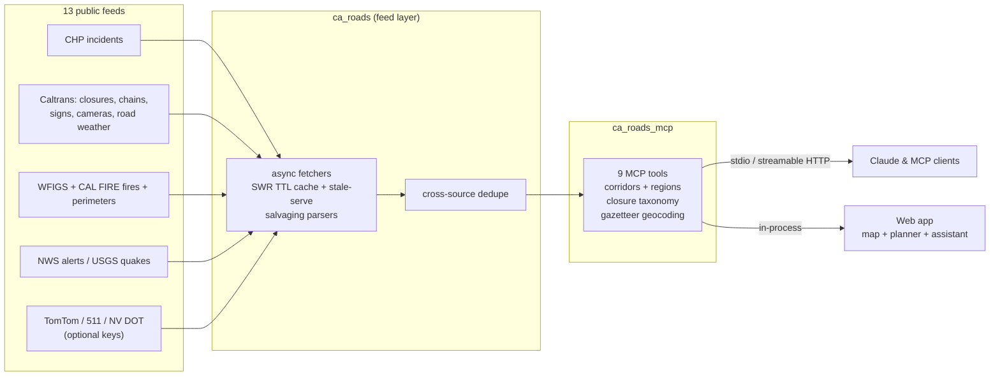

# Architecture

Three packages, cleanly layered:

- **`ca_roads`**: the feed layer. No MCP dependency. Async httpx
  fetchers, per-district TTL caches with stale-while-revalidate (an
  expired feed serves from memory instantly and refreshes in the
  background), stale-serve on upstream failure, parsers that salvage
  complete records from truncated feeds, and rules learned from running
  these feeds in production. Details: [data sources](data-sources.md).
- **`ca_roads_mcp`**: the MCP surface. FastMCP server, curated
  corridor and region tables, route-name normalization, an offline
  California gazetteer, and docstrings written for the LLM consumer.
  Details: [the MCP server](mcp.md).
- **`ca_roads_demo`**: the web app at
  [commutescout.com](https://commutescout.com). The standalone map and
  route planner (viewport-driven data API, address autocomplete,
  turn-by-turn via OSRM with a Valhalla fallback), watch-area alerts
  (web push + email), trip share pages, plus Claude in a tool loop over
  the same tool functions, streaming SSE with map geometry and hard
  cost caps: per-IP rate limits, daily question caps, a global daily
  dollar budget.

The layering is strict: the web app and the MCP server both sit on
`ca_roads`, so a fix to a parser or cache benefits every surface at
once.

## Design choices worth knowing

- **Everything is stateless and in-process.** The hosted demo runs a
  single Cloud Run instance; every rate and cost guard lives in process
  memory, which is why the service deploys with `--max-instances 1`.
- **Feeds fail loudly, serve quietly.** Upstream failures never blank a
  layer: the last good data is served, flagged stale, with the error
  attached and surfaced all the way to the UI and the MCP response.
- **Evals gate releases.** Recorded-fixture scenarios and 91 golden
  questions run against every release tag; the scorecard and its full
  history are committed to the repo. See [EVALS.md](../EVALS.md).

## Related docs

- [Self-hosting / deploying](deploy.md)
- [Data sources & parsing rules](data-sources.md)
- [The MCP server & tools](mcp.md)
- [Adding a data source](adding-a-source.md)
