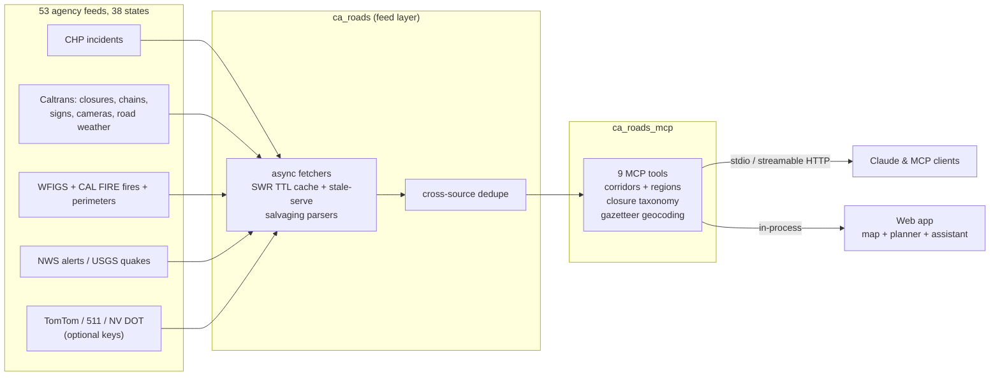

# Architecture

```mermaid
flowchart LR
    subgraph feeds["53 agency feeds, 38 states"]
        CHP["CHP incidents"]
        CT["Caltrans: closures, chains,<br/>signs, cameras, road weather"]
        WF["WFIGS + CAL FIRE fires + perimeters"]
        WX["NWS alerts / USGS quakes"]
        OPT["TomTom / 511 / NV DOT<br/>(optional keys)"]
    end
    subgraph pkg["ca_roads (feed layer)"]
        F["async fetchers<br/>SWR TTL cache + stale-serve<br/>salvaging parsers"]
        D["cross-source dedupe"]
    end
    subgraph srv["ca_roads_mcp"]
        T["9 MCP tools<br/>corridors + regions<br/>closure taxonomy<br/>gazetteer geocoding"]
    end
    CHP & CT & WF & WX & OPT --> F --> D --> T
    T -->|"stdio / streamable HTTP"| MCP["Claude & MCP clients"]
    T -->|"in-process"| DEMO["Web app<br/>map + planner + assistant"]
```

Three packages, cleanly layered:

- **`ca_roads`**: the feed layer. No MCP dependency. Async httpx
  fetchers, per-district TTL caches with stale-while-revalidate (an
  expired feed serves from memory instantly and refreshes in the
  background), stale-serve on upstream failure, parsers that salvage
  complete records from truncated feeds, and rules learned from running
  these feeds in production. Details: [data sources](data-sources.md).
- **`ca_roads_mcp`**: the MCP surface. FastMCP server, curated
  corridor and region tables, route-name normalization, an offline
  California gazetteer, and docstrings written for the LLM consumer.
  Details: [the MCP server](mcp.md).
- **`ca_roads_demo`**: the web app at
  [commutescout.com](https://commutescout.com). The standalone map and
  route planner (viewport-driven data API, address autocomplete,
  turn-by-turn via OSRM with a Valhalla fallback), watch-area alerts
  (web push + email), trip share pages, plus Claude in a tool loop over
  the same tool functions, streaming SSE with map geometry and hard
  cost caps: per-IP rate limits, daily question caps, a global daily
  dollar budget.

The layering is strict: the web app and the MCP server both sit on
`ca_roads`, so a fix to a parser or cache benefits every surface at
once.

## Design choices worth knowing

- **The map's read path never touches compute.** A background publisher
  builds the whole coverage area once per cycle and uploads pre-gzipped
  snapshots to GCS behind a CDN; the browser boots from an edge-cached
  static object. Nothing about that payload was ever per-user, so
  building it per request only bought a cold-start wait: a cache miss
  cost 1.2 s to first byte, against 30 ms from the edge. Feed warming
  and upstream outages can no longer delay a visitor, because the last
  good snapshot is already on the edge. The publisher skips its upload
  while feeds are warming or a build looks degraded, so a bad cycle
  keeps the previous complete map rather than replacing it with an
  empty one, and the payload's `published` timestamp drives a "data as
  of" chip so age is always visible. `/api/mapdata` still serves the
  assistant, routing, watch areas and lazy closure geometry. Details:
  [deploy](deploy.md#map-snapshots-optional-demo-service).
- **Long-lived tabs are a supported case.** The map is meant to sit on a
  wall monitor for weeks: it polls every 30 s (a 304 against the
  snapshot ETag costs almost nothing), catches up immediately on
  `visibilitychange`/`online` because browsers throttle hidden-tab
  timers, and soft-reloads itself when a deploy changes the payload
  schema out from under it.
- **Everything is stateless and in-process.** The hosted demo runs a
  single Cloud Run instance; every rate and cost guard lives in process
  memory, which is why the service deploys with `--max-instances 1`.
- **Feeds fail loudly, serve quietly.** Upstream failures never blank a
  layer: the last good data is served, flagged stale, with the error
  attached and surfaced all the way to the UI and the MCP response.
- **Evals gate releases.** Recorded-fixture scenarios and 91 golden
  questions run against every release tag; the scorecard and its full
  history are committed to the repo. See [EVALS.md](../EVALS.md).

## Related docs

- [Self-hosting / deploying](deploy.md)
- [Data sources & parsing rules](data-sources.md)
- [The MCP server & tools](mcp.md)
- [Adding a data source](adding-a-source.md)
